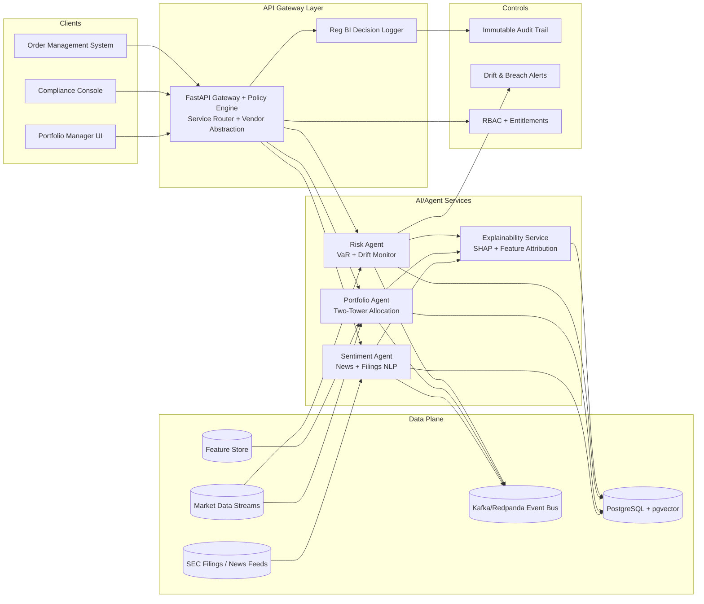

# Agentic Finance Platform Architecture (SEC/FINRA-Aligned)

## 1) System Architecture Diagram

## 2) Control and Compliance Design Notes

- **Reg BI explainability:** every recommendation or risk action persists feature attributions and rationale text in `explanations` and `decision_logs`.
- **Vendor lock-in prevention:** gateway routes through a provider interface (`OpenAI`, `Anthropic`, local `vLLM`) selected by policy and can be hot-swapped without downstream changes.
- **Supervisory controls:** all agent outputs are evented and logged with model version, confidence, and human override metadata.

## 3) Agent Orchestration Pattern

1. Ingest market/news/filings payload.
2. Run model inference.
3. Compute explainability artifacts (SHAP/feature contribution).
4. Evaluate policy thresholds (risk, concentration, drift).
5. Persist decision + explanations + policy outcome.
6. Emit event to bus for downstream execution/monitoring.
